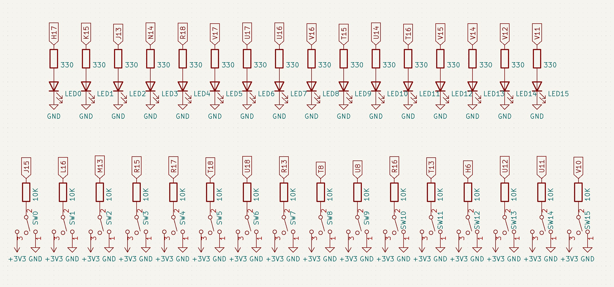

# Lab 3: Marek CoufaL

### Pre-lab pinout preparation

| Switch #  | GPIO | LED #  | GPIO |
| ------------- | ------------- | ------------- | ------------- |
| 0  | J15  | 0  | H17  |
| 1  | L16  | 1  | K15  |
| 2  | M13  | 2  | J13  |
| 3  | R15  | 3  | N14  |
| 4  | R17  | 4  | R18  |
| 5  | T18  | 5  | V17  |
| 6  | U18  | 6  | U17  |
| 7  | R13  | 7  | U16  |
| 8  | T8  | 8  | V16  |
| 9  | U8  | 9  | T15  |
| 10  | R16  | 10  | U14  |
| 11  | T13  | 11  | T16  |
| 12  | H6  | 12  | V15  |
| 13  | U12  | 13  | V14  |
| 14  | U11  | 14  | V12  |
| 15  | V10  | 15  | V11  |




### Three-bit wide 4-to-1 multiplexer

1. Listing of VHDL architecture from source file `mux_3bit_4to1.vhd`. Always use syntax highlighting, meaningful comments, and follow VHDL guidelines:

```vhdl
architecture Behavioral of mux_3bit_4to1 is
begin

    -- WRITE YOUR CODE HERE

end architecture Behavioral;
```

2. Screenshot with simulated time waveforms. Always display all inputs and outputs (display the inputs at the top of the image, the outputs below them) at the appropriate time scale!

   

3. Listing of pin assignments for the Nexys A7 board in `nexys-a7-50t.xdc`. **DO NOT list** the whole file, just your switch and LED settings.

```shell
##Switches
#set_property -dict { PACKAGE_PIN J15   IOSTANDARD LVCMOS33 } [get_ports { SW[0] }]; #IO_L24N_T3_RS0_15 Sch=sw[0]
#set_property -dict { PACKAGE_PIN L16   IOSTANDARD LVCMOS33 } [get_ports { SW[1] }]; #IO_L3N_T0_DQS_EMCCLK_14 Sch=sw[1]
#set_property -dict { PACKAGE_PIN M13   IOSTANDARD LVCMOS33 } [get_ports { SW[2] }]; #IO_L6N_T0_D08_VREF_14 Sch=sw[2]
...

## LEDs
#set_property -dict { PACKAGE_PIN H17   IOSTANDARD LVCMOS33 } [get_ports { LED[0] }]; #IO_L18P_T2_A24_15 Sch=led[0]
#set_property -dict { PACKAGE_PIN K15   IOSTANDARD LVCMOS33 } [get_ports { LED[1] }]; #IO_L24P_T3_RS1_15 Sch=led[1]
#set_property -dict { PACKAGE_PIN J13   IOSTANDARD LVCMOS33 } [get_ports { LED[2] }]; #IO_L17N_T2_A25_15 Sch=led[2]
...
```